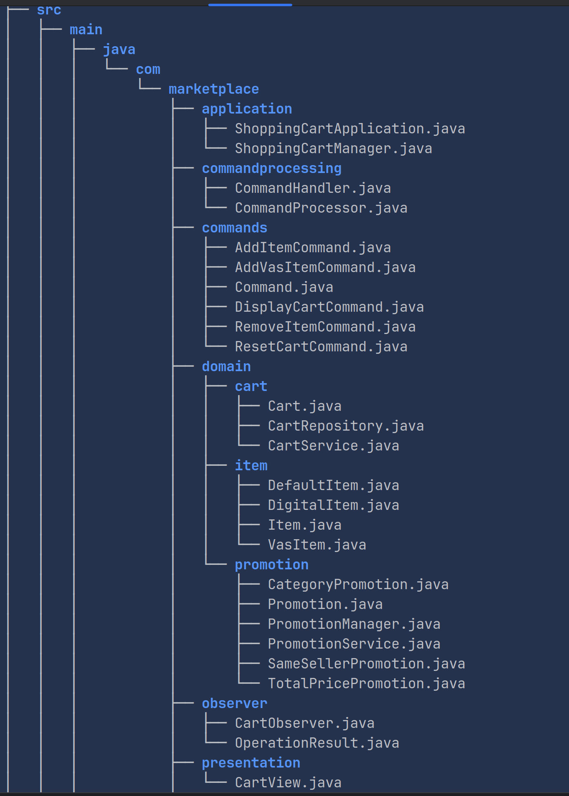

# ShoppingCart Application README

## Overview

The ShoppingCart application is a sophisticated software solution designed to simulate the operations of an online shopping cart, with a focus on robustness, flexibility, and user-friendliness. It employs the Command Pattern to handle user actions and the Observer Pattern to monitor and respond to cart state changes. This application has been meticulously crafted following SOLID, SRP (Single Responsibility Principle), OOP (Object-Oriented Programming) principles, ensuring a high degree of code quality and maintainability. The architecture is highly decoupled, facilitating easy modifications and extensions.

## Key Features

- **Command Pattern Implementation:** Enables encapsulation of request as an object, thus allowing users to perform user actions such as adding or removing items, displaying the cart, and resetting the cart.
- **Observer Pattern Utilization:** Monitors shopping cart operations, ensuring that any state change triggers appropriate actions or notifications.
- **Comprehensive Unit Testing:** With over 95% code coverage, the application ensures reliability and functionality through rigorous testing.
- **Domain-Driven Design (DDD):** Organized into layers such as application, commands, domain, observer, presentation, and utility, aligning closely with DDD principles for clarity and efficiency.
- **Decoupled Architecture:** Facilitates ease of code maintenance and future enhancements.
- **Constants File:** Centralizes the management of application-wide constants for better consistency and easier updates.

## Folder Structure

